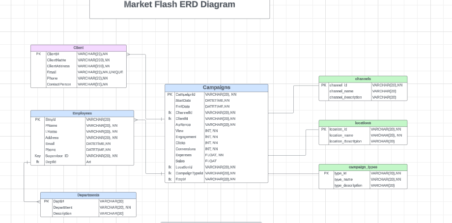
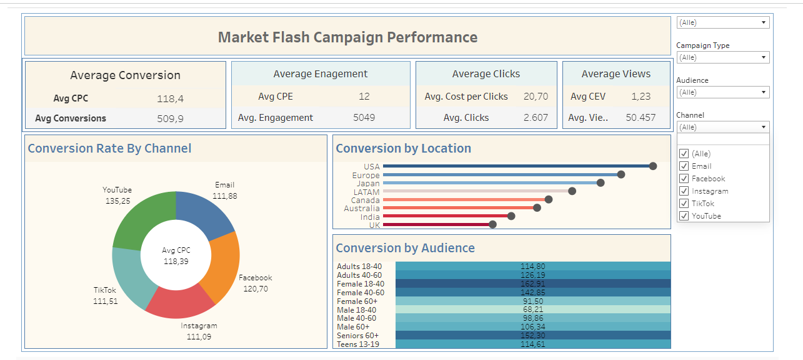

# MarketFlash Campaign Performance Analysis

## Project Overview
The MarketFlash Campaign Performance Analysis project aims to analyze marketing campaigns based on key performance indicators (KPIs) such as Average Conversion, Average Engagement, Average Clicks, and Average Views. The purpose of this analysis is to provide insights into the effectiveness of various marketing channels, audience segments, and geographical locations, with a primary focus on the **Average Conversion** KPI.

## Data Structure
The data used in this project is organized across multiple tables with relationships as shown in the Entity-Relationship Diagram (ERD). The main entities include:

- **Campaigns**: Information about each marketing campaign, including start and end dates, target audience, channels used, and various performance metrics.
- **Employees**: Details about employees involved in campaigns, such as name, department, and employee ID.
- **Clients**: Information on clients for whom the campaigns were executed.
- **Channels**: Different marketing channels (e.g., Email, Facebook, YouTube) used in the campaigns.
- **Locations**: Geographical regions targeted by campaigns.
- **Audience Segments**: Targeted demographics categorized by age, gender, and other criteria.

## Key KPIs
The main KPIs analyzed in this project include:

1. **Average Conversion** (Primary KPI)
   - Measures the rate at which audiences take desired actions (e.g., sign-ups, purchases).
   - Analyzed by Channel, Audience, and Location.

2. **Average Engagement**
   - Measures the interaction level of the audience with the campaign.
   - Helps in identifying the channels and segments that drive the most engagement.

3. **Average Clicks**
   - Measures the click-through rate and cost per click (CPC).
   - Important for channels where cost efficiency is critical.

4. **Average Views**
   - Measures the visibility of campaigns across different channels.

## Analysis Overview
The analysis focuses primarily on the **Average Conversion** KPI across various dimensions to understand what factors contribute to campaign success:

- **By Channel**: Identifying which channels (e.g., YouTube, Facebook, Email) perform best in terms of conversion rates.
- **By Audience Segment**: Analyzing demographic groups, such as age and gender, to pinpoint the most responsive segments.
- **By Location**: Examining regional performance to allocate resources effectively.

## Insights and Recommendations
The insights derived from the analysis highlight areas of strength and opportunities for improvement. Key recommendations include:

- **Focus on High-Performing Channels**: Prioritize resources for channels with higher conversion rates.
- **Target Specific Audience Segments**: Invest in audience segments with strong engagement and conversion metrics.
- **Optimize by Location**: Tailor marketing strategies based on regional performance trends.

## Files
--  The Entity-Relationship Diagram illustrating the data structure. **ERD.png** :
- Screenshot of the main dashboard showing KPIs by channel, audience, and location. : 
- A PowerPoint presentation summarizing the project insights.  [Updated Presentation](./Updated_MarketFlash_Campaign_Performance_Presentation.pptx): 

## Future Work
Additional analyses could include predictive modeling to forecast campaign performance and deeper analysis of engagement metrics to refine targeting strategies.
